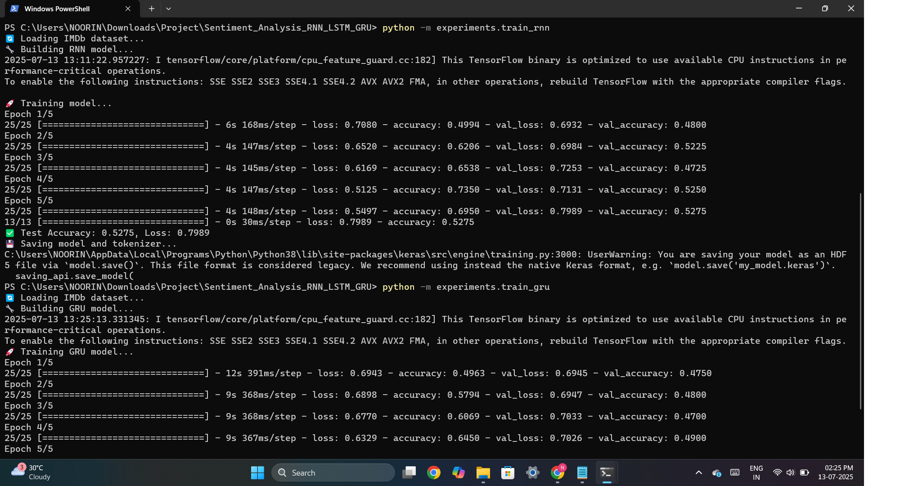
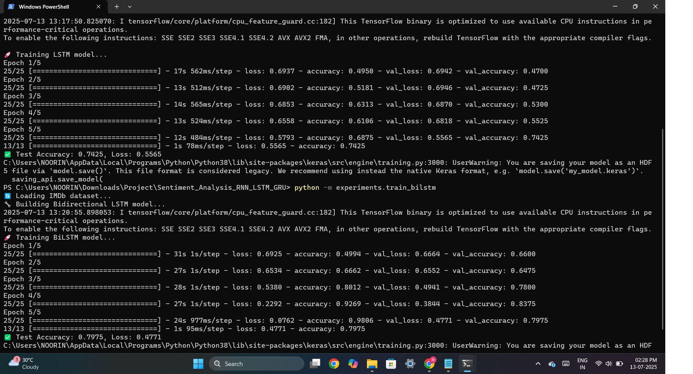
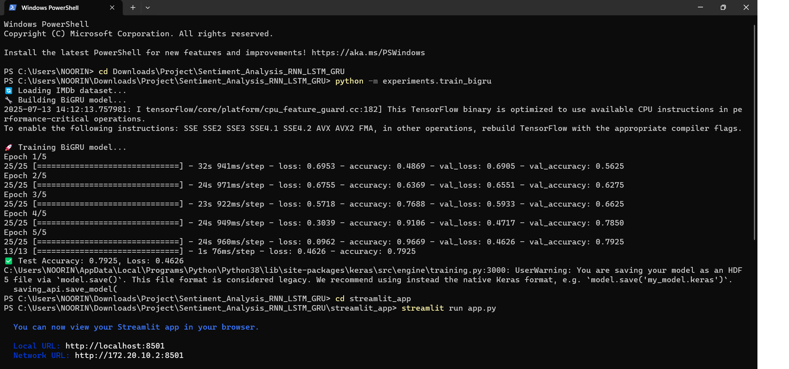
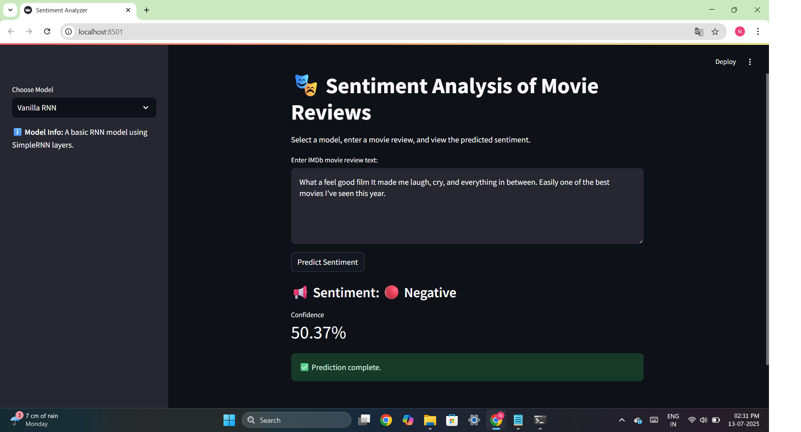
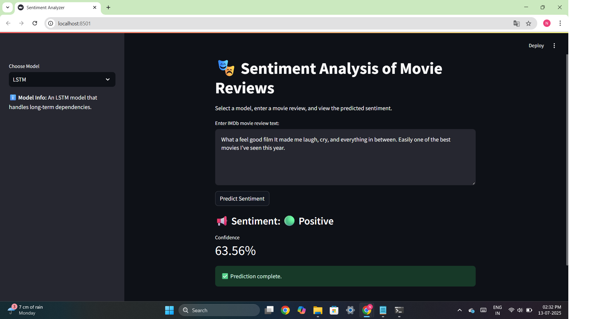
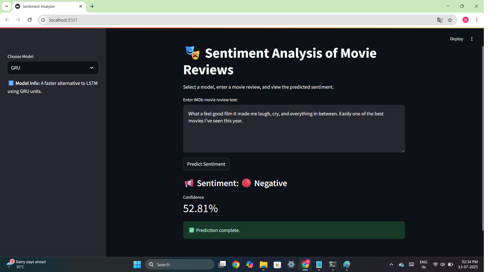
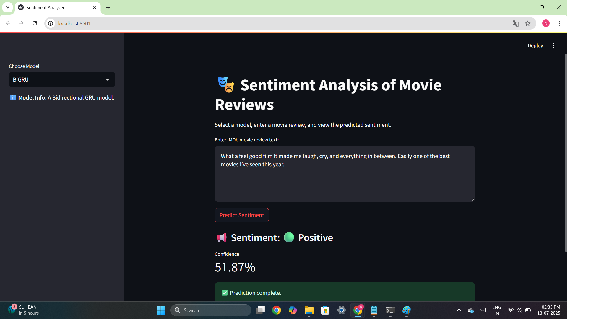

# 🎭 Sentiment Analysis of IMDb Movie Reviews using RNN, LSTM, BiLSTM, GRU & BiGRU

This project implements and compares multiple deep learning models for sentiment analysis of IMDb movie reviews. It includes:

✅ Vanilla RNN  
✅ LSTM  
✅ Bidirectional LSTM (BiLSTM)  
✅ GRU  
✅ Bidirectional GRU (BiGRU)  

A custom **Streamlit web application** is built for real-time prediction and comparison of all trained models.

---

## 📁 Project Structure

Sentiment_Analysis_RNN_LSTM_GRU/
│
├── data/
│ ├── raw/ # IMDb dataset
│ └── processed/ # (optional)
│
├── utils/
│ └── data_loader.py # Preprocessing logic
│
├── models/
│ ├── rnn.py
│ ├── lstm.py
│ ├── bilstm.py
│ ├── gru.py
│ └── bigru.py
│
├── experiments/
│ ├── train_rnn.py
│ ├── train_lstm.py
│ ├── train_bilstm.py
│ ├── train_gru.py
│ └── train_bigru.py
│
├── checkpoints/
│ ├── *_model.h5 # Trained models
│ ├── *_tokenizer.pkl # Tokenizers
│ └── *_training_plot.png # Training graphs
│
├── streamlit_app/
│ └── app.py # Streamlit Web UI
│
├── screenshots/
│ └── *.png # Output screenshots (terminal + UI)
│
└── README.md


---

## 🔍 Dataset

- 📦 Dataset: IMDb Movie Reviews Dataset  
- 📄 50,000 labeled reviews for binary classification (Positive/Negative)
- ✅ Already downloaded and placed in `data/raw/aclImdb/`

---

## 🧠 Models Used

| Model      | Description                                     |
|------------|-------------------------------------------------|
| Vanilla RNN | Basic Recurrent Neural Network (SimpleRNN)      |
| LSTM       | Handles long-term dependencies                  |
| BiLSTM     | Bidirectional LSTM captures forward + backward  |
| GRU        | Gated Recurrent Unit (lighter than LSTM)        |
| BiGRU      | Bidirectional GRU                               |

---

## 🚀 How to Run

### ⚙️ Step 1: Train Models

Each training script will:
- Train model
- Evaluate
- Save `.h5` and `.pkl` files
- Plot training loss/accuracy

Example:
```bash
python -m experiments.train_rnn
python -m experiments.train_lstm
...

### 🌐 Step 2: Run Streamlit Web App

cd streamlit_app
streamlit run app.py

---

## 📷 Screenshots

### Terminal:





### streamlit app:








---
##🙋‍♀️ Author

Noorin Nasir Khot
M.Tech (AI & DS)
IIIT Kota

---

> 💡 *“One problem, many solutions. Deep learning is an art of choosing the best!”*